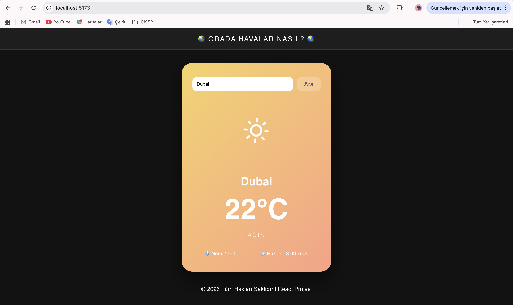
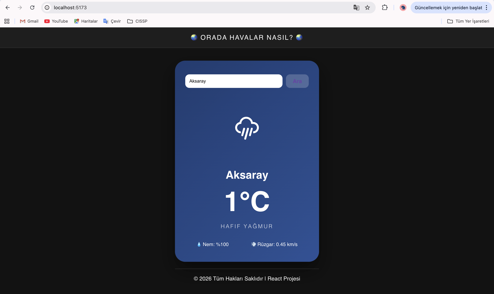
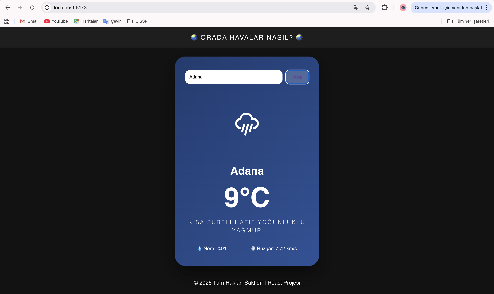
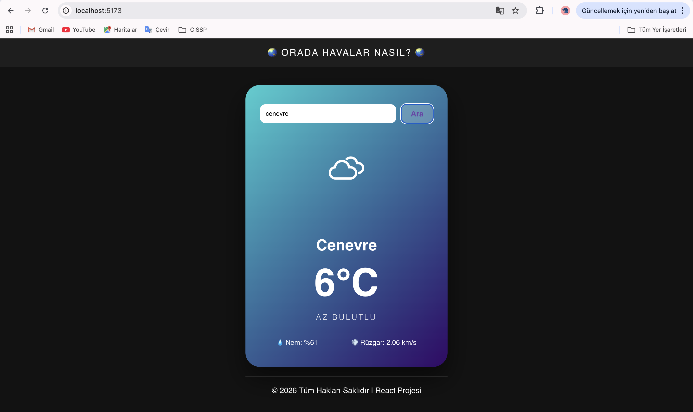
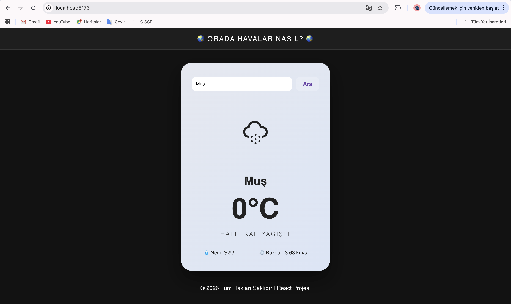
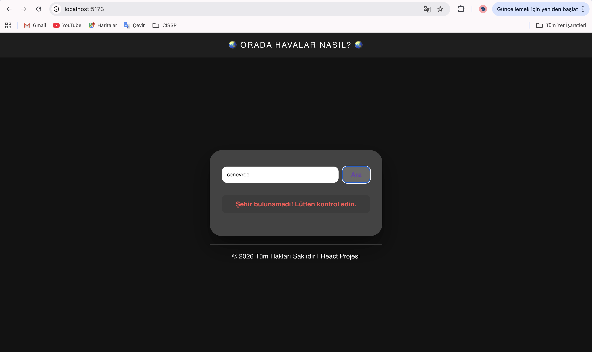

**React Hava Durumu Uygulaması (Weather App)
Bu proje, bir API kullanarak dinamik verilerin çekildiği ve hava durumuna göre kullanıcı arayüzünün (UI) anlık olarak değiştiği bir web uygulamasıdır.

**Kullanılan API
### API: OpenWeatherMap API API_KEY = "e0167d21893bff39a3a0c782fac783f9";

Veri Türü: Canlı hava durumu verileri (Sıcaklık, Nem, Rüzgar Hızı, Hava Durumu Açıklaması).

**Projenin Çalıştırılması
Projeyi yerel bilgisayarınızda çalıştırmak için aşağıdaki adımları izleyin:

*Bağımlılıkları Yükleyin:

### Bash

npm install

*Kütüphaneleri Ekleyin (Gerekirse):

### Bash

npm install axios react-icons

*Uygulamayı Başlatın:

### Bash

npm run dev

### Tarayıcıda http://localhost:5173 adresine gidin.*

*Teknik Özellikler ve Gereksinimler
1. Bileşen Yapısı (Components)
Proje, hiyerarşik olarak 3 ana bileşenden oluşmaktadır:

Header: Uygulama başlığı bölümü.

WeatherContent: API entegrasyonu, arama motoru ve verilerin kart şeklinde listelendiği ana bölüm.

Footer: Telif hakları bilgilerini içeren bölüm.

2. React Hookları
useState: Şehir ismi, hava durumu verileri, yüklenme durumu ve hata mesajlarını yönetmek için kullanıldı.

useEffect: Uygulama ilk açıldığında varsayılan bir şehrin (Ankara) verilerini otomatik getirmek için kullanıldı.

3. Dinamik Özellikler ve Kullanıcı Deneyimi
Dinamik Arka Plan: Hava durumuna göre (Clear, Clouds, Rain, Snow) uygulamanın renk paleti (Gradient) değişmektedir.

Animasyonlu İkonlar: react-icons kütüphanesi kullanılarak hava durumuna uygun hareketli görseller eklenmiştir.

Yükleniyor (Loading): Veri çekme aşamasında kullanıcıya bilgilendirme mesajı gösterilir.

Hata Yönetimi: Geçersiz şehir adı girildiğinde kullanıcıya kırmızı bir hata uyarısı gösterilir.

Bonus: Input üzerinden dinamik parametre gönderimi (Arama özelliği) aktiftir.

 Ekran Görüntüsü
 ##  Ekran Görüntüleri

### Güneşli Hava Durumu

### Yağmurlu Hava Durumu

### Bulutlu Hava Durumu

### Karlı Hava Durumu

### Hata Yönetimi
